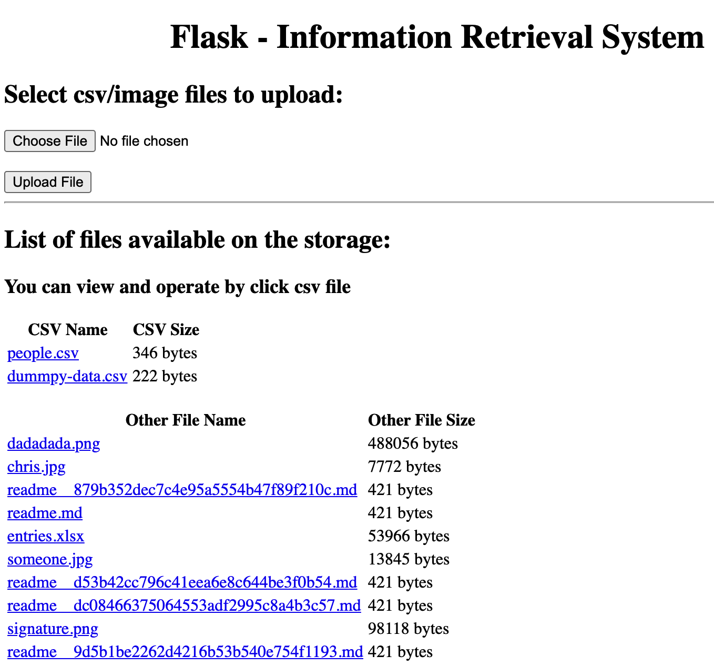
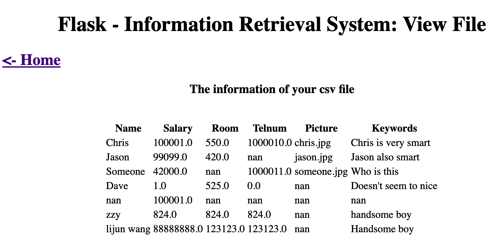
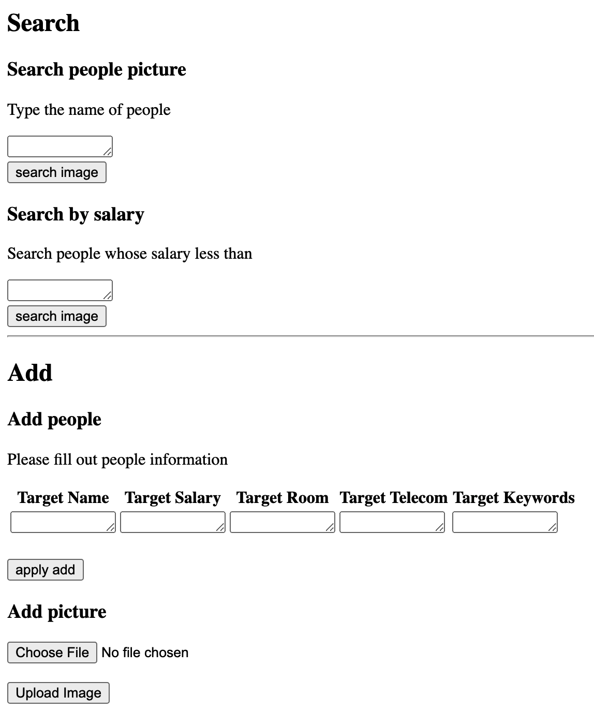
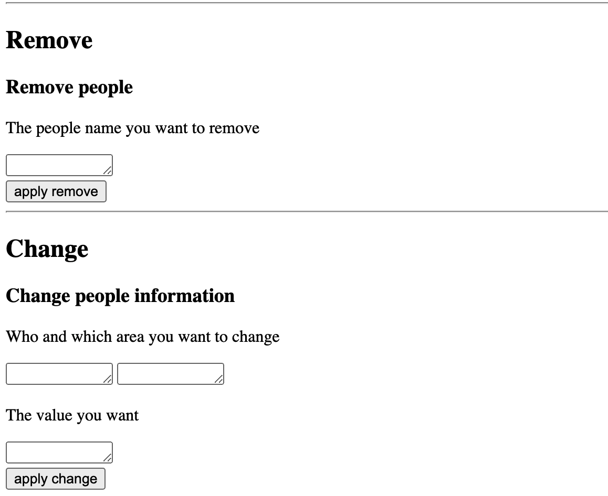

# CSE-6331 Cloud Computing

## Demo Endpoint

1. IBM Cloud: http://zzy824.us-south.cf.appdomain.cloud/
2. Google App Engine: http://myresearch.uc.r.appspot.com/ **(deprecated)**

## Setup Environment

- For Local Test

``` sh
pip install -r requirements.txt
cd hw1 && python main.py
```

- For deployment

1. IBM Cloud: make sure you have configured database(db2) before hand.

``` sh
git clone https://github.com/824zzy/CSE6331_CloudComputing.git
cd hw1
cf login
cf push
```

2. Google Cloud Platform: make sure your app engine is `Flex` rather than Standard

``` sh
git clone https://github.com/824zzy/CSE6331_CloudComputing.git
cd hw1 && google app deploy
```

For hw2, you need to export environment variable: `export DYLD_LIBRARY_PATH=[your path to python]/site-packages/clidriver/lib:$DYLD_LIBRARY_PATH`

## Screen Shots

### Homework1

1. Home Page

<p align="center">
  
</p>

2. Display items

<p align="center">
  
</p>

3. API: Search & Add

<p align="center">
  
</p>

4. API: Remove & Change

<p align="center">
  
</p>

### Homework2

## About Author

- Name: Zhengyuan Zhu
- StuId: 1001778274
